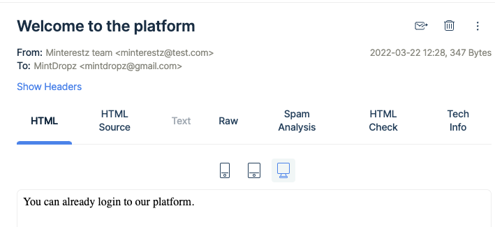
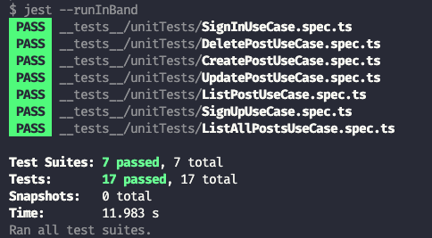
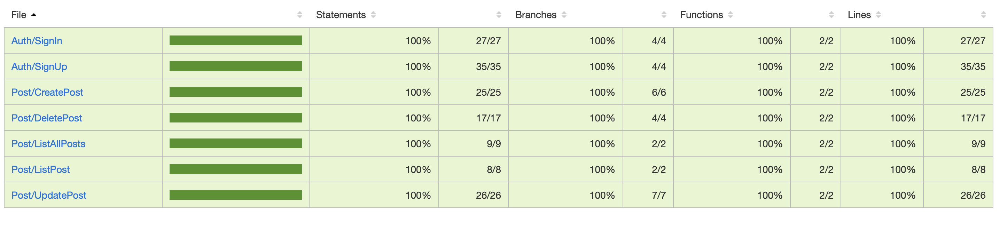
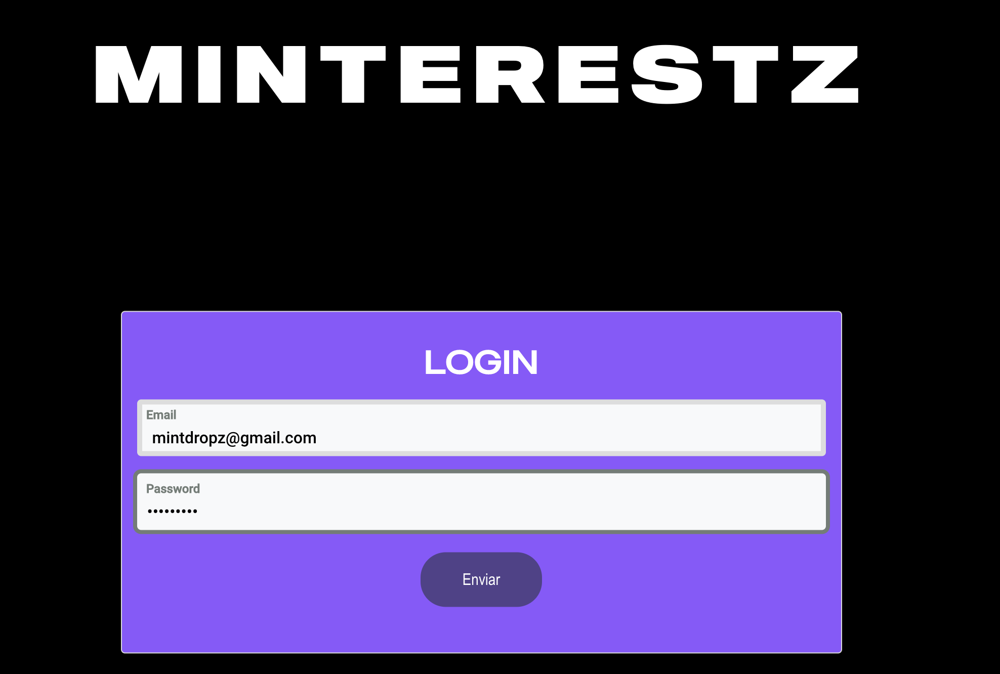

# Exercise

Your Goal is to build a small application where a user can create a post on their own social media type platform.

[x] - Create an expressjs server

[x] - Connect mongodb atlas with this server

[x] - Create a user model with name email password image

[x] - Create an api get the data (name email password , image) and save it using mongodb

[x] - Step5- Password should be hashed using bycrypt js

[x] - Validate the email is not already exist and not invalid

[x] - Send the response with created user without password

[x] - Create Post model with image title and description

[x] - Create post functionality

[x] - Get all post functionality

[x] - Get post by id functionality

[x] - User can delete his own post

[x] - User can update his own post

[x] - Only signed in user can see all post

[x] - Implement Authorization flow make apis private

# Project Architecture

The API is written following SOLID principles to ensure maintainability as the project grows. These practices can also contribute to avoiding code smells, code refactoring, and agile or adaptive software development.

- S - Single-responsiblity Principle

All Controllers and Services have a single responsibility throughout the code.

 

- O - Open-closed Principle

All entities are just being extended and never modified.

 

- L - Liskov Substitution Principle

All derived classes can be replaced by parent class along the code.

 

- I - Interface Segregation Principle

The classes are never forced to implement an interface they don't use throughout the code.

 

- D - Dependency Inversion Principle

All entities depend on abstractions, not concretions.

 

The API is also following the Domain-driven-design (DDD) approach where each structure must match its business domain.

 

### All the images are being stored at Amazon S3 and the aplication is running in a AWS EC2 instance.

    BASE URL: http://ec2-54-207-192-146.sa-east-1.compute.amazonaws.com:3334

# Available Endpoints

## Authentication

 

### Sign up a new User.

    There is already a user in the database with the credentials:

    name: MintDropz
    email: mintdropz@gmail.com
    password: mintdropz

    Feel free to sign up new users.

    curl --request POST \
    --url http://ec2-54-207-192-146.sa-east-1.compute.amazonaws.com:3334/signUp \
    --header 'Content-Type: application/json' \
    --data '{
        "name": "User",
        "email": "user@test.com",
        "password": "Password"
    }'

    When the user signs up, a welcome email is sent.

    MailTrap provider is being used as email testing tool (https://mailtrap.io).

  

 

### Sign in a user

    The response is a JWT token that needs to be passed in the next requests.

    curl --request POST \
    --url http://ec2-54-207-192-146.sa-east-1.compute.amazonaws.com:3334/signIn \
    --header 'Content-Type: application/json' \
    --data '{
        "email": "mintdropz@gmail.com",
        "password": "mintdropz"
    }'

 

## Posts

 

### Create a post

    curl --request POST \
    --url http://ec2-54-207-192-146.sa-east-1.compute.amazonaws.com:3334/posts \
    --header 'Authorization: {:token}' \
    --header 'Content-Type: multipart/form-data; boundary=---011000010111000001101001' \
    --form 'file={:file}' \
    --form title="Some Title" \
    --form description="Some Description"

 

### List all posts

    curl --request GET \
    --url http://ec2-54-207-192-146.sa-east-1.compute.amazonaws.com:3334/posts \
    --header 'Authorization: {:token}'

 

### List one post

    curl --request GET \
    --url http://ec2-54-207-192-146.sa-east-1.compute.amazonaws.com:3334/posts/{:id} \
    --header 'Authorization: {:token}'

 

### Update a post

    curl --request PUT \
    --url http://ec2-54-207-192-146.sa-east-1.compute.amazonaws.com:3334/posts/{:id} \
    --header 'Authorization: {:token}' \
    --header 'Content-Type: multipart/form-data; boundary=---011000010111000001101001' \
    --form 'file={:file}' \
    --form title="New Title" \
    --form description="New Description"

 

### Delete a post

    curl --request DELETE \
    --url http://ec2-54-207-192-146.sa-east-1.compute.amazonaws.com:3334/posts/{:id} \
    --header 'Authorization: {:token}'

 

Click the button below to download the Insomnia file with the available endpoints.

All requests are already chained to the sign in route.

# Tests

## All endpoints mentioned above were tested with the jest library to ensure they are working properly.

  

## The coverage is at 100% as seen in the image below.

 

# Minterestz

## I created a small web application called Minterestz (mix of mintdropz and pinterest) to consume the API endpoints.

 

Login to the application with an existent user (use the /signUp route on Insomnia to create new users).

  

    https://minterestz.netlify.app/

 

# Thanks for reading!

 

_Clean code always looks like it was written by someone who cares._

_Michael Feathers_
